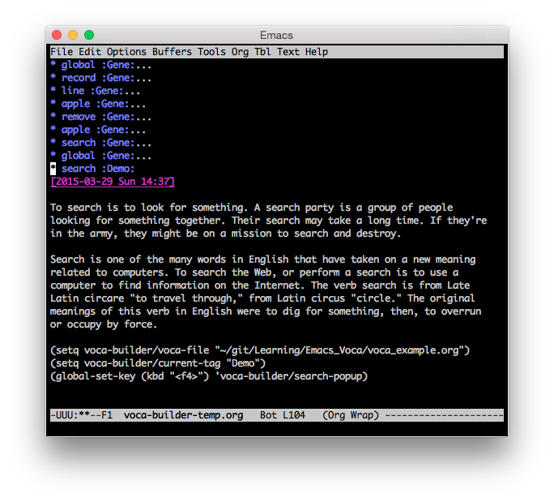

Yi Tang
=======

    :Author: Yi Tang

.. contents::
1 Usage :ExportFile:
-------

1.1 Fetch the meaning
~~~~~~~~~~~~~~~~~~~~~

[2015-06-17 Wed 11:12]

If I would like to know what the meaning of **search** means in English,
I moved the cursor to *c* under *search*, and press ``F4``. The meaning
will popup up under the word, as shown below. I don't have to switch
to a dictionary app and it won't break my read-flow. 

.. image:: ./img/Poup-show-.png

Also, as the echo area shows, the full meaning and also the full
sentence will be added to the voca-file. 

Here is a real example when I was reading an article.

.. image:: ./img/Popup-real-example.png

1.2 Export vocabularies by tags
~~~~~~~~~~~~~~~~~~~~~~~~~~~~~~~

[2015-06-17 Wed 11:12]

It is useful when you want to group vocabularies and revise
them altogether, for example, all the biology terms. You can do it
using ``voca-builder/extract-by-tags`` function. For example, 

.. code-block:: scheme

    (voca-builder/extract-by-tags "Demo")

will export all the vocabularies that are tagged by "Demo" to
~/voca-builder-temp.org. 

1.3 Export vocabularies by date
~~~~~~~~~~~~~~~~~~~~~~~~~~~~~~~

[2015-06-17 Wed 11:12]

You may also want to export all the new vocbaulary you learnt during
one particular period, like a semaster, an academic year using
``voca-builder/extract-period`` function. For example

.. code-block:: scheme

    (voca-builder/extract-period "2015-01-05" "2015-04-01")

will export all the vocabularies that are recorded between "2015-01-05" and
"2014-04-01". 

.. image:: ./img/Export-Tag-Demo-Period-Range.png

Note you can combine these two function together. 
